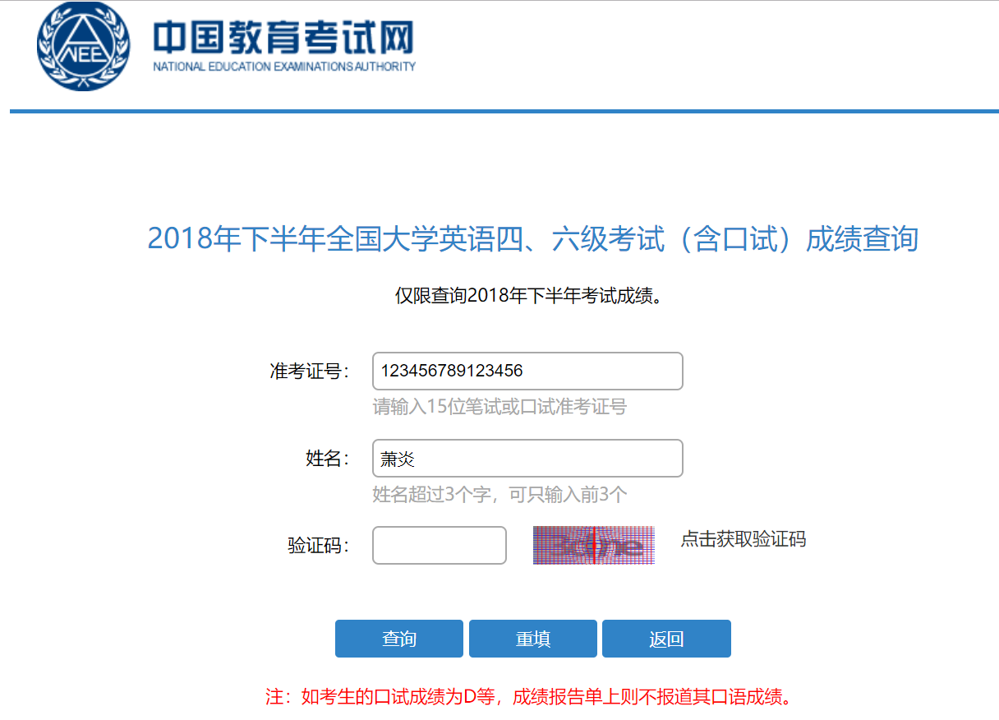
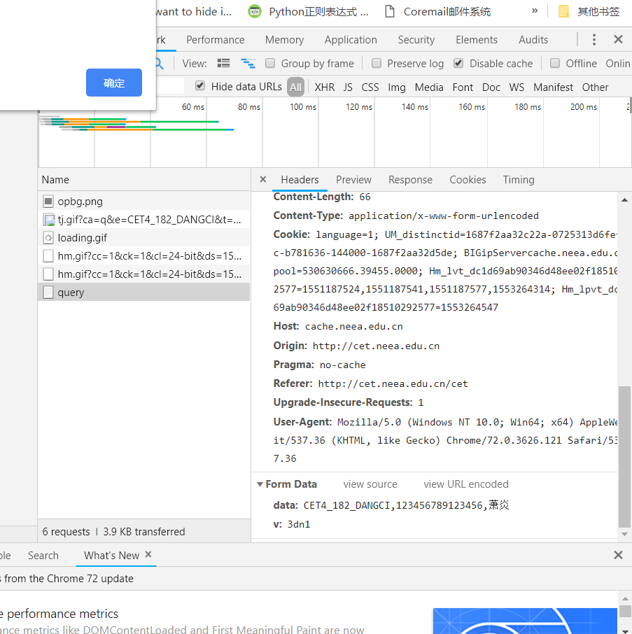
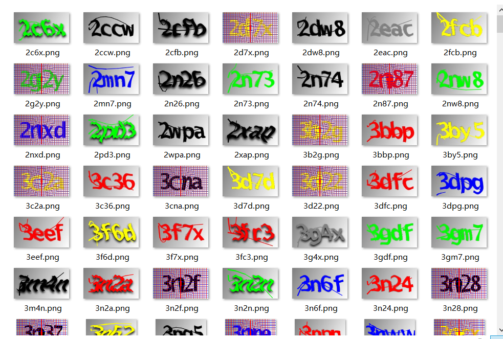
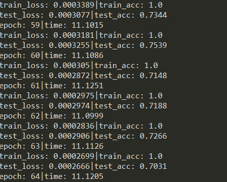
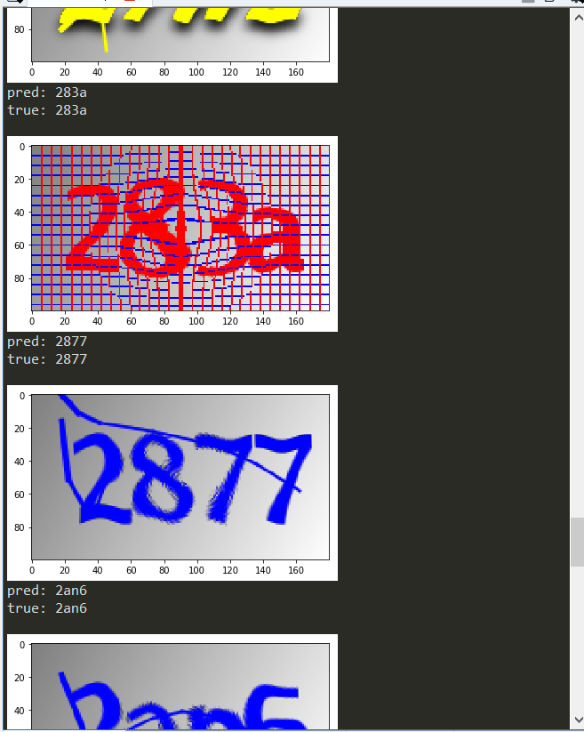

# pytorch-captcha
使用pytorch搭建cnn识别验证码

数据集：
链接: https://pan.baidu.com/s/1pHSl-5nHJWazXVqda-2IcA 提取码: mv3u 复制这段内容后打开百度网盘手机App，操作更方便哦

下载数据集后在根目录解压，运行train.py开始训练

----------

# pytorch入门实战之验证码识别


本文将使用pytorch框架训练一个四层卷积神经网络，用以识别四位数字字母区分大小的验证码。

## 1. 引言 ##

去年四六级查分时候我把准考证号忘了，准考证一时也找不到，最后是靠试准考证号试出来的，因为和我同一个考场的同学准考证号只有最后两位座位号不一样，一个考场不超过30人，遍历座位号就能试出来。
  
四六级查分系统有一个四位数字字母验证码，如果能够自动识别验证码，就能不断遍历准考证号查分了，不用手段输入验证码查分，效率大大提高，不知道淘宝上“忘记准考证号帮查四六级分”服务是不是这样做的。

## 2. 数据收集 ##

四六级查分网页链接为[http://cet.neea.edu.cn/cet](http://cet.neea.edu.cn/cet)  


首先按Fn+F12使用网页开发者工具抓包看一下验证码是如何请求，以及如何提交查询信息并返回结果。最好不要一次性把三条信息都输对，那样会直接跳到查询结果页，不方便查看提交查询的请求。



可以很容易的找到提交请求的是一个post请求，请求地址为`http://cache.neea.edu.cn/cet/query`，请求参数有两个，分别是`data`和`v`，`data`是由一串固定字符和准考证号以及姓名组成，`v`则是验证码。通过构建查询请求，我们可以知道验证码是否输入正确。点击获取验证码按钮，可以抓包获取到验证码的请求，将验证码请求以及提交查询写成python代码如下：


	def get_captcha_img():
    	ik = '123456789123456'
    	rand = random.random()
    	img_path = '{}/{}.png'.format(false_dir, rand)
    	imgs_url = 'http://cache.neea.edu.cn/Imgs.do?c=CET&ik={}&t={}'.format(ik, 
    	                                                      rand)
    	headers = {'Referer': 'http://cet.neea.edu.cn/cet'}
    	resp = sess.get(imgs_url, headers=headers)
    	img_url = re.findall(r'"([^"]*)?"', resp.text)[0]
    	img_resp = sess.get(img_url, headers=headers)
    	with open(img_path, 'wb') as f:
    	    f.write(img_resp.content)
    	return img_path  

	def check_captcha(v):
    	query_url = 'http://cache.neea.edu.cn/cet/query'
    	data = {'data': 'CET4_181_DANGCI,123456789123456,萧炎',
    	        'v': v}
    	headers = {'Referer': 'http://cet.neea.edu.cn/cet'}
    	resp = sess.post(query_url, headers=headers, data=data)
		#    print(resp.text)
    	if '抱歉，验证码错误！' in resp.text:
        	return False
    	else:
        	return True

结合以上请求验证码以及提交查询信息判断验证码是否正确的方法，再通过打码平台，可以获得带有正确标记的验证码图片。
使用上述方法，我获得了1181张带有标注的验证码，宽和高为（180，100），将其分为训练集与测试集，训练集为800张，测试及381张。我看过的其他使用卷积神经网络识别验证码的文章，使用的训练集数量多达几千上万张，大多都是自己用程序生成的，本文使用打码平台标记的验证码，就不要求那么大的数据集了，但也能达到满意的效果。

还值得一提的是，使用打码平台标注验证码，成功标注了1181张外，还有将近四百张验证码识别失败，粗略估计，这个打码平台准确率在75%左右。  



## 3. CNN模型搭建 ##

CNN主要由卷积层，池化层，激活函数组成，再加上一个BatchNorm，BatchNorm叫做批规范化，可以加速模型的收敛速度。

模型代码如下：

	import torch.nn as nn
	
	class CNN(nn.Module):
    	def __init__(self, num_class=36, num_char=4):
    	    super(CNN, self).__init__()
    	    self.num_class = num_class
    	    self.num_char = num_char
    	    self.conv = nn.Sequential(
    	            #batch*3*180*100
    	            nn.Conv2d(3, 16, 3, padding=(1, 1)),
    	            nn.MaxPool2d(2, 2),
    	            nn.BatchNorm2d(16),
    	            nn.ReLU(),
    	            #batch*16*90*50
    	            nn.Conv2d(16, 64, 3, padding=(1, 1)),
    	            nn.MaxPool2d(2, 2),
    	            nn.BatchNorm2d(64),
    	            nn.ReLU(),
    	            #batch*64*45*25
    	            nn.Conv2d(64, 512, 3, padding=(1, 1)),
    	            nn.MaxPool2d(2, 2),
    	            nn.BatchNorm2d(512),
    	            nn.ReLU(),
    	            #batch*512*22*12
    	            nn.Conv2d(512, 512, 3, padding=(1, 1)),
    	            nn.MaxPool2d(2, 2),
    	            nn.BatchNorm2d(512),
    	            nn.ReLU(),
    	            #batch*512*11*6
    	            )
    	    self.fc = nn.Linear(512*11*6, self.num_class*self.num_char)
    	    
    	def forward(self, x):
    	    x = self.conv(x)
    	    x = x.view(-1, 512*11*6)
    	    x = self.fc(x)
    	    return x

nn.Sequential()可以看作模块的有序容器，可以方便快捷的搭建神经网络。  
网络的输入是一个shape为`[batch, 3, 180, 100]`的张量，batch代表的是一个批次图片数量，3代表输入的图片是3通道的，即RGB，180和100则分别代表图片的宽和高。  

主要的结构如下：


1. 第一个卷积层`nn.Conv2d(3, 16, 3, padding=(1, 1))`，参数分别对应着输入的通道数3，输出通道数16，卷积核大小为3（长宽都为3），padding为（1， 1）可以保证输入输出的长宽不变。shape为`[batch, 3, 180, 100]`的张量通过这个卷积层，输出一个shape为`[batch, 16, 180, 100]`的张量。  


2. 接着一个最大池化层`nn.MaxPool2d(2, 2)`，参数分别对应着池化窗口大小为2（长宽都为2），步长为3. 输出的长宽为输入的一半，如果长宽为奇数的话则补边。输入一个shape为`[batch, 16, 180, 100]`的张量，输出为一个shape为`[batch, 16, 90, 50]`的张量。  
4. 批规范层`nn.BatchNorm2d(16)`，16为输入张量的通道数。  
5. 激活函数`nn.ReLu()`，就是把小于0的值置0，大于0的值不变，使用激活函数是为了引入非线性，让模型可以拟合更复杂的函数。 


经过4组如上结构的卷积后，得到一个shape为`[batch, 512, 11, 6]`的张量，`x.view(-1, 512*11*6)`将改变张量的shape为`[batch, 512*11*6]`，再用一个`[512*11*6, num_class*num_char]`的全连接层映射为一个`[batch, num_class*num_char]`张量，这个就是模型的输出，其中`num_class`代表字符的种类数量，`num_char`代表一张验证码图片含有的字符数量，分别为36与4。  

## 4. 数据加载 ##
pytorch有非常方便高效的数据加载模块--Dataset和DataLoader。  
Dataset是数据样本的封装，可以很方便的读取数据。实现一个Dataset的子类，需要重写`__len__`和`__getitem__`方法，`__len__`需要返回整个数据集的大小，`__getitem__`提供一个整数索引参数，一个样本数据（一个图片张量和一个标签张量）。  
验证码图片的Dataset代码如下：  

	class CaptchaData(Dataset):
    	def __init__(self, data_path, num_class=36, num_char=4, 
    	             transform=None, target_transform=None, alphabet=alphabet):
    	    super(Dataset, self).__init__()
    	    self.data_path = data_path
    	    self.num_class = num_class
    	    self.num_char = num_char
    	    self.transform = transform
    	    self.target_transform = target_transform
    	    self.alphabet = alphabet
    	    self.samples = make_dataset(self.data_path, self.alphabet, 
    	                                self.num_class, self.num_char)
    	
    	def __len__(self):
    	    return len(self.samples)
    	
    	def __getitem__(self, index):
    	    img_path, target = self.samples[index]
    	    img = img_loader(img_path)
    	    if self.transform is not None:
    	    	img = self.transform(img)
    	    if self.target_transform is not None:
            	target = self.target_transform(target)
        	return img, torch.Tensor(target)  

其中`make_dataset`为读取图片路径和标签的函数，返回`[(img_path, target), (img_path, target), ...]`的数据形式。`img_loader`为读取图片的函数，并且转换成RGB三通道。
这两个函数具体实现如下： 
 
	def img_loader(img_path):
	    img = Image.open(img_path)
	    return img.convert('RGB')
	
	def make_dataset(data_path, alphabet, num_class, num_char):
	    img_names = os.listdir(data_path)
	    samples = []
	    for img_name in img_names:
	        img_path = os.path.join(data_path, img_name)
	        target_str = img_name.split('.')[0]
	        assert len(target_str) == num_char
	        target = []
	        for char in target_str:
	            vec = [0] * num_class
	            vec[alphabet.find(char)] = 1
	            target += vec
	        samples.append((img_path, target))
	    return samples  

DataLoader是Dataset的进一步封装，Dataset每次通过`__getitem__`方法取到的是一个样本，经过DataLoader封装为dataloader后，每次取的是一个batch大小的样本批次。  

	transforms = Compose([ToTensor()])
	train_dataset = CaptchaData('./data/train', transform=transforms)
    train_data_loader = DataLoader(train_dataset, batch_size=batch_size, num_workers=0, 
                             shuffle=True, drop_last=True)
    test_data = CaptchaData('./data/test', transform=transforms)
    test_data_loader = DataLoader(test_data, batch_size=batch_size, 
                                  num_workers=0, shuffle=True, drop_last=True)
`transforms`是数据预处理操作，一般数据增强就通过transform实现，可以随机亮度，随机翻转，随机缩放等等。此处只使用了`ToTensor()`，将`PIL.Image`对象转换成Tensor。

## 5. 训练 ##

训练网络的一般流程为：  
1. 定义网络  
2. 定义优化器`optimizer`和损失函数`criterion`  
3. 遍历`dataloader`，每次取一个batch训练。计算loss，将优化器梯度置零，loss向后传播，计算梯度，优化器更新参数。    
4. 训练集训练完一个epoch后，使用测试集计算下准确率。  
5. 保存模型  
主要代码如下：  
```
    cnn = CNN()
    if torch.cuda.is_available():
        cnn.cuda()
    optimizer = torch.optim.Adam(cnn.parameters(), lr=base_lr)
    criterion = nn.MultiLabelSoftMarginLoss()
    
    for epoch in range(max_epoch):
        cnn.train()
        for img, target in train_data_loader:
            img = Variable(img)
            target = Variable(target)
            if torch.cuda.is_available():
                img = img.cuda()
                target = target.cuda()
            output = cnn(img)
            loss = criterion(output, target)
            optimizer.zero_grad()
            loss.backward()
            optimizer.step()
        
        loss_history = []
        acc_history = []
        cnn.eval()
        for img, target in test_data_loader:
            img = Variable(img)
            target = Variable(target)
            if torch.cuda.is_available():
                img = img.cuda()
                target = target.cuda()
            output = cnn(img)
            
            acc = calculat_acc(output, target)
            acc_history.append(acc)
            loss_history.append(float(loss))
        torch.save(cnn.state_dict(), model_path)  
```
其中，`cnn.train()`将网络切换到训练状态，`cnn.eval()`将网络切换到模型评估状态，这两者的差别主要体现在dropout和batchnorm层中，模型评估状态下，将不会启用dropout层，batchnrom不会更新均值和标准差。`cnn.cuda()`将数据张量分配到cuda设备上（英伟达显卡），加快运算速度。 
损失函数使用的是`nn.MultiLabelSoftMarginLoss()`，多分类多标签损失函数。每个类别有多个标签，集每张验证码有四个字符。

选择accuracy（预测准确率）做为模型的评估指标，需要再编写一个计算准确率的函数：  
	
	def calculat_acc(output, target):
    	output, target = output.view(-1, 36), target.view(-1, 36)
    	output = nn.functional.softmax(output, dim=1)
    	output = torch.argmax(output, dim=1)
    	target = torch.argmax(target, dim=1)
    	output, target = output.view(-1, 4), target.view(-1, 4)
    	correct_list = []
    	for i, j in zip(target, output):
    	    if torch.equal(i, j):
    	        correct_list.append(1)
    	    else:
    	        correct_list.append(0)
    	acc = sum(correct_list) / len(correct_list)
    	return acc  

训练结果：  
  

最终训练了五十几个epoch后，测试集准确率最高达75%，训练集已过拟合达100%。  
再将验证码打印出来，预测与实际标签对比：


## 6. 结语 ##
仅使用800张验证码图片做为训练集，就能最终达到75%的准确率，效果还是比较满意的，已经和打码平台差不多了。要想进一步的提高准确率，需要扩充数据集。可以将已经训练好，准确率达到75%的模型代替打码平台，去获取更多标注好的验证码。数据集充分的情况下，准确率达到90%是比较容易的。  

